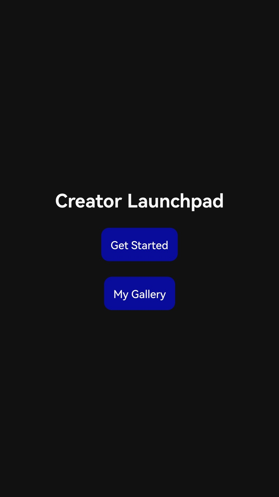
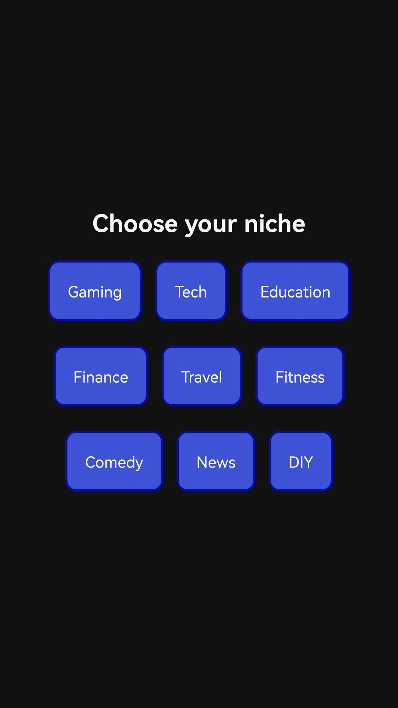
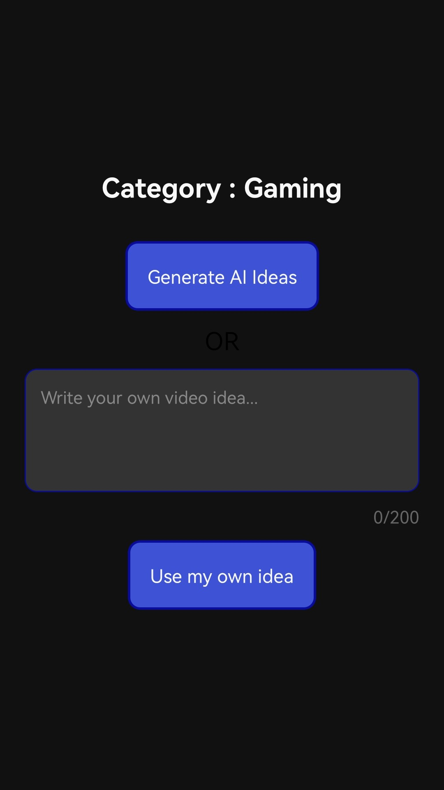
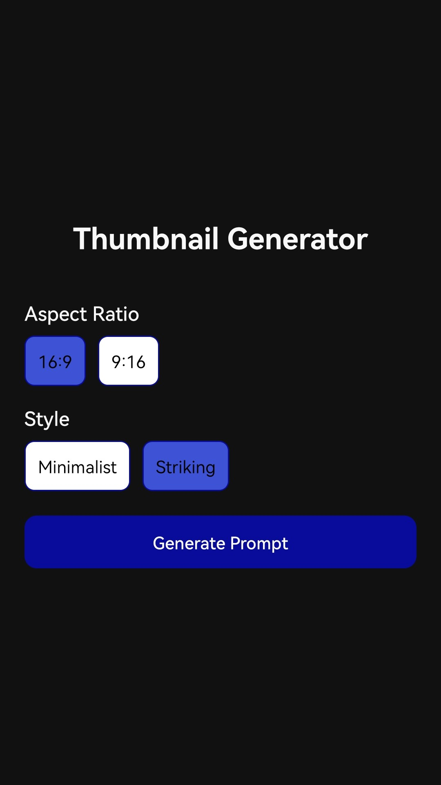
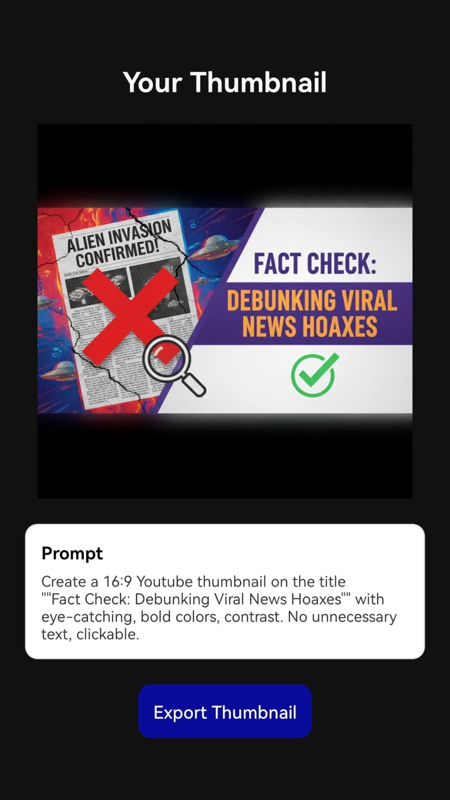
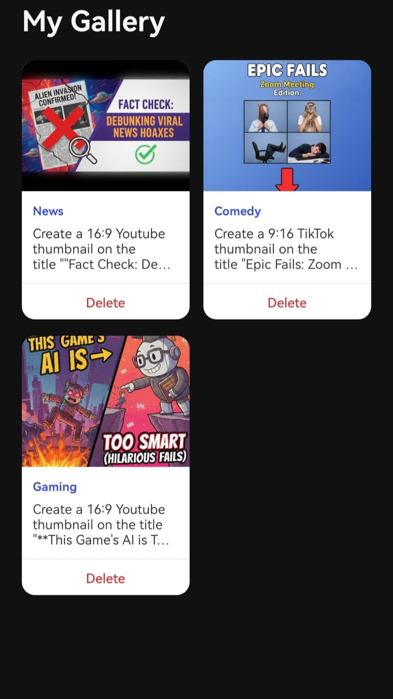
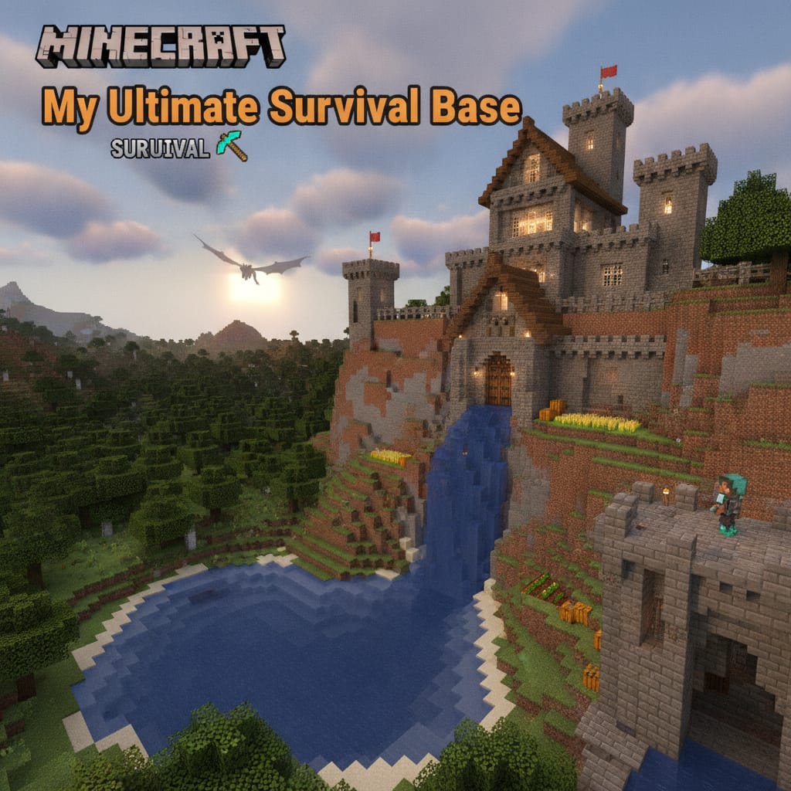

# Creator Launchpad

*Launch your next video faster*

## What is Creator Launchpad

Creator Launchpad is an AI-powered mobile app designed to help content creators go from an idea to a ready-to-use thumbnail. Users can generate video ideas, create thumbnails and save them to a personal gallery where they can be shared. **If you are here for testing, see this file:**[Testing instructions](TESTERS.md)

## Preview Screenshots

  
  
  

  
  
  
  

## How did I come up with this project?

Along the years I have dabbled with content creation from time to time, and I think that it is something that everyone should be able to enjoy. With the rising competitiveness in modern content creation, keeping up can sometimes feel difficult so when I was thinking about what kind of app I could make, I thought it would be cool to make one that streamlines the creator process.

You make your video, but in order to appeal to an audience you need some way to market it. Thumbnails allow users to quickly spot your video and are largely the reason why someone might choose or not choose to click on your video. Creator Launchpad enables you to type in your video idea, and generate a suitable thumbnail to be used on YouTube or TikTok or any other social media platform (primarily orientated towards short form videos). Don't have an idea? Well you can simply ask to generate ideas and then generate thumbnails that you can use.

## Features:

- Video idea generation
- Category-based ideas
- Quick inspiration
- Simple and clean mobile interface
- Dark mode
- Gallery to save and manage thumbnails

## Thumbnail generation examples

  
  
  
  
  
  

## Pages

- Home: lets new users generate their first thumbnail, or access the gallery
- Category: lets user pick a creator category to generate thumbnails with
- Idea Gen: lets user pick to generate ideas or type their own
- Generated ideas: gives a list of generated ideas with the option to regenerate them
- Thumbnail options: has two simple options (currently) which change the final thumbnail
- Result: shows the finished thumbnail with its prompt
- Gallery: shows all generated thumbnails to manage and view

## Challenges and Improvements

The development of this app was difficult merely due to my lack of knowledge in the Gemini API. I spent a lot of initial time just trying to communicate with Nano Banana and Gemini 2.5, even getting basic text out was a pain since I kept getting hit with rate limit errors but eventually I managed to get it working. I was also initially using Firebase but made the switch to Supabase purely because it has more features for free users.

I would say in the future, adding more customisation options would really help the user experience. Also adding a login could mean that the user can input details about what their content creation entails and then the app could suggest ideas weekly, sending notifications and such.

### Tech Stack

- React Native
- Expo
- Gemini API
- Supabase
